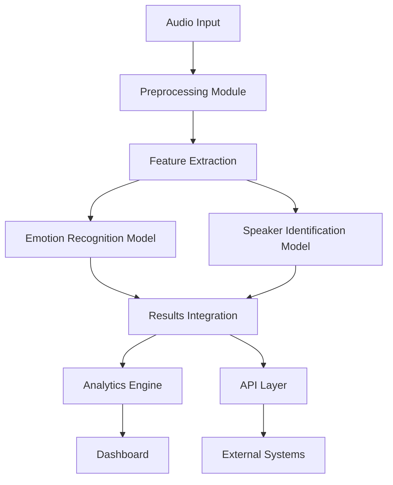
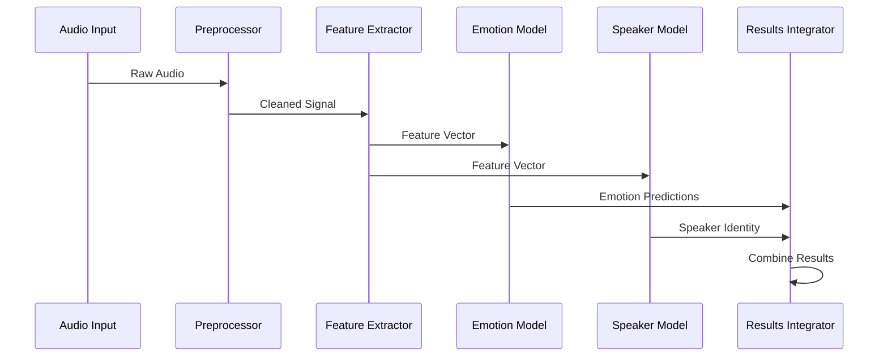
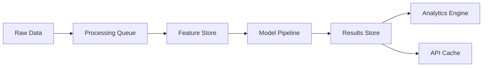
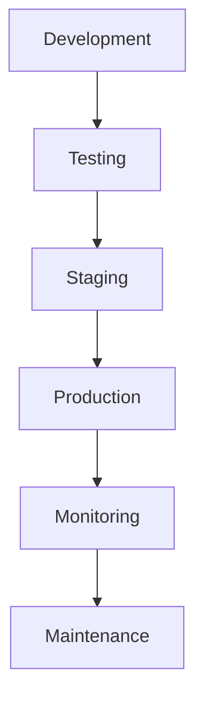

# System Patterns

## System Architecture Overview

### High-Level Architecture

## Technical Decisions

### 1. Data Processing Pipeline
- **Pattern**: Pipeline Architecture
- **Implementation**: Sequential processing stages with clear interfaces
- **Rationale**: Enables modular development and easy pipeline modifications
- **Components**:
  - Audio Capture
  - Signal Preprocessing
  - Feature Extraction
  - Model Processing
  - Results Integration

### 2. Model Architecture
- **Pattern**: Microservices Architecture
- **Implementation**: Separate services for emotion recognition and speaker identification
- **Rationale**: Independent scaling and maintenance of different models
- **Components**:
  - Emotion Recognition Service
  - Speaker Identification Service
  - Model Management Service
  - Inference Orchestrator

### 3. Data Management
- **Pattern**: Repository Pattern
- **Implementation**: Centralized data access layer
- **Rationale**: Consistent data access and manipulation
- **Components**:
  - Data Access Layer
  - Cache Manager
  - Storage Service
  - Backup Service

### 4. API Design
- **Pattern**: REST Architecture
- **Implementation**: RESTful endpoints with versioning
- **Rationale**: Standard interface for external integration
- **Components**:
  - API Gateway
  - Authentication Service
  - Rate Limiter
  - Response Formatter

## Component Interrelationships

### 1. Core Processing Flow

### 2. Data Flow Architecture

## Design Patterns

### 1. Structural Patterns
- **Factory Pattern**: Model creation and initialization
- **Adapter Pattern**: External system integration
- **Facade Pattern**: Simplified API interface
- **Proxy Pattern**: Caching and access control

### 2. Behavioral Patterns
- **Observer Pattern**: Real-time updates and notifications
- **Strategy Pattern**: Interchangeable processing algorithms
- **Chain of Responsibility**: Audio processing pipeline
- **Command Pattern**: Task queue management

### 3. Creational Patterns
- **Singleton Pattern**: Configuration management
- **Builder Pattern**: Complex object construction
- **Prototype Pattern**: Model instance creation
- **Abstract Factory**: Service creation

## Error Handling Strategy

### 1. Error Categories
- Input Validation Errors
- Processing Errors
- Model Inference Errors
- System Errors
- Integration Errors

### 2. Error Management
- Centralized error logging
- Graceful degradation
- Automatic recovery mechanisms
- User-friendly error messages

## Performance Optimization

### 1. Caching Strategy
- Model inference results
- Frequently accessed data
- API responses
- Feature vectors

### 2. Resource Management
- Memory pooling
- Connection pooling
- Thread management
- GPU utilization

## Security Patterns

### 1. Authentication
- JWT-based authentication
- Role-based access control
- API key management
- Session management

### 2. Data Protection
- End-to-end encryption
- Data anonymization
- Secure storage
- Access logging

## Monitoring and Logging

### 1. System Metrics
- Performance metrics
- Resource utilization
- Error rates
- Response times

### 2. Application Logs
- Activity logs
- Error logs
- Audit logs
- Performance logs

## Testing Strategy

### 1. Test Categories
- Unit Tests
- Integration Tests
- System Tests
- Performance Tests
- Security Tests

### 2. Test Implementation
- Automated testing pipeline
- Continuous integration
- Test coverage monitoring
- Regression testing

## Deployment Architecture

## Version Control Strategy

### 1. Branch Management
- Feature branches
- Development branch
- Staging branch
- Main branch
- Hotfix branches

### 2. Release Management
- Semantic versioning
- Release notes
- Changelog maintenance
- Rollback procedures 